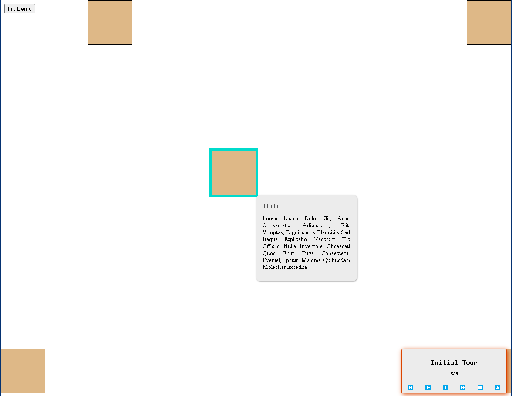

# WebTourJS

Simple Pop-up Manager based on HTML Step Elements. Provides a way to create Tours Directly on HTML.



## Usage 

* Import WebTour.css and WebTour.js. 
* Create the WebTourStep Elements.

```
    <!-- HTML Elements -->
    <div id="targetID"  onclick="console.log('Clic Auto Div 2')"></div>
    <div id="targetID2" onclick="console.log('Clic Auto Div 2')"></div>
 
    <!-- WebTourJS Step Elements -->
    <webtour-step 
        step-target="targetID" 
        step-event="click"
        step-eventtarget="targetID2"
        step-number="1" 
        step-title="A Good Title" 
        step-content="Lorem ipsum dolor sit, amet consectetur adipisicing elit. Voluptas, dignissimos blanditiis sed itaque explicabo nesciunt hic officiis nulla inventore obcaecati quos enim fuga consectetur eveniet, ipsum maiores quibusdam molestias expedita">     
    </webtour-step>

    <webtour-step 
        step-target="targetID2" 
        step-event="click"
        step-eventtarget="targetID"
        step-number="2" 
        step-title="A Good Title" 
        step-content="Lorem ipsum dolor sit, amet consectetur adipisicing elit. Voluptas, dignissimos blanditiis sed itaque explicabo nesciunt hic officiis nulla inventore obcaecati quos enim fuga consectetur eveniet, ipsum maiores quibusdam molestias expedita">
    </webtour-step>
```
* Create the WebTour Instance and Run.
```
<script>
    var WebTourInstance = new WebTour({ title : "Initial Tour", duration : 1500, order : ["1", "2"] });
    WebTourInstance.showTourPlayer();
</script>
```

## Demo 

* Clone the Repo.
* Open index.html, clic init Demo. 
* Start the Tour clicking the Play Emoji.
* Check Browser's Dev Tools.